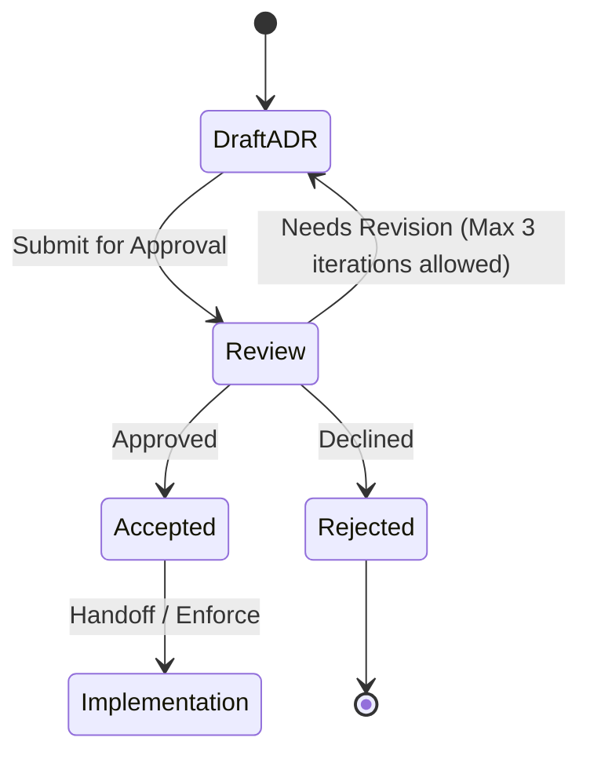

# Architectural Decision Record (ADR)

Use this template when a choice has lasting architectural consequences: a dependency, a data model, a boundary, a protocol, or a rejected alternative that future agents must not rediscover from scratch.

**Quality bar:** A reader who was not in the discussion can apply the decision, know when it does *not* apply, and see what to revisit if a consequence fails. One decision per ADR.

**Do not use this for:** implementation notes, ticket status, or RFCs that are still exploring options. Promote an RFC to an ADR only after a decision is made.

## Title

`ADR-NNNN: <short noun phrase>` — outcome, not a topic. Prefer "Use Postgres for billing ledger" over "Database".

## Status

One of: `Proposed` | `Accepted` | `Rejected` | `Deprecated` | `Superseded by ADR-NNNN`.

- Date of this status and author/role (not a blamed individual).
- If superseded, link the replacement and one sentence on why.

## Context

Facts that force a decision. Stick to evidence from the repo, RFC, or user:

- Problem and why "do nothing" is costly
- Constraints (scale, compliance *as stated by the user*, existing MUST/NEVER from Domain/Layer consultants)
- Non-goals and out-of-scope items
- Deadline or event that makes delay expensive (if any)

## Decision

State the choice in one or two sentences, then the rules others must follow:

- What we will do, and where it applies (services, layers, environments)
- What we will stop doing
- Default when a new case appears

## Alternatives considered

For each serious alternative (at least one besides the winner):

| Option | Why it was plausible | Why it lost |
|---|---|---|
| … | … | … |

Do not invent options that were never discussed. If only one option was viable, say so and why.

## Consequences

Split explicitly:

- **Positive** — what becomes cheaper, safer, or clearer
- **Negative / accepted trade-offs** — what becomes harder; operational cost
- **Follow-ups** — migrations, ADRs, or RFCs this creates (owners as roles)

## Compliance

How an agent or reviewer checks that new work honors this ADR:

- [ ] Code or config that must exist
- [ ] Patterns that are now forbidden
- [ ] Tests or monitors that lock the decision in

## Related

- Domain / Layer consultants consulted (names only)
- Linked RFCs, tickets, diagrams
- Related ADRs

## Anti-patterns

- Topic titles ("Caching") with no chosen option
- Hidden decisions buried in a PR description
- Status `Accepted` with empty consequences
- Re-litigating a stable ADR inside a user story instead of superseding it

## Skill State Machine (sdlc-adr-drafter)

