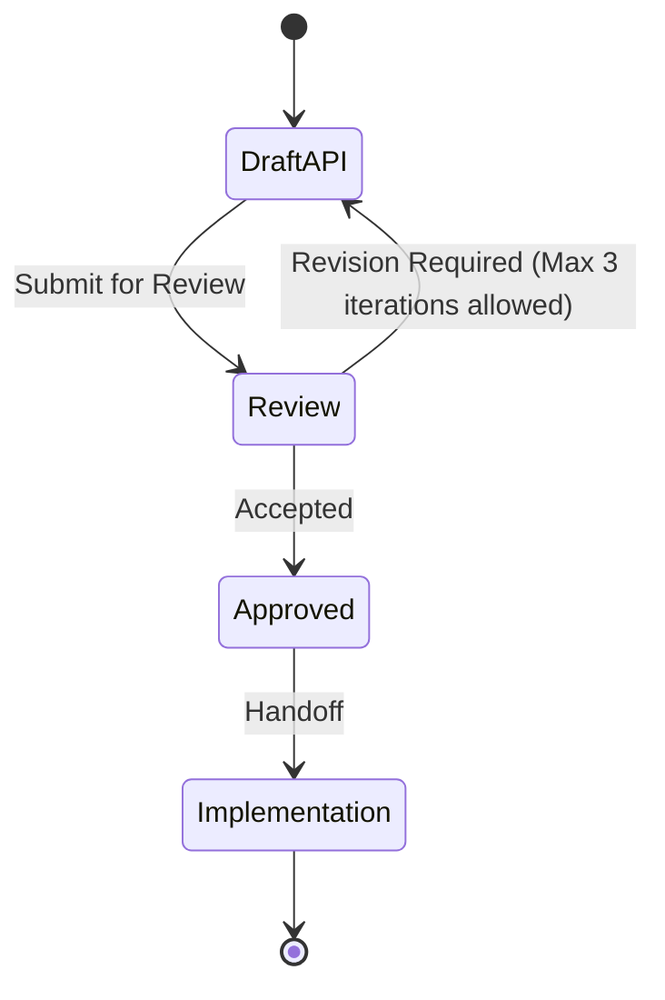

# API Design

Design-time document for an HTTP or RPC API before (or while) the contract is frozen. Pair with skill `sdlc-api-designer` and template `api_contract` for field-level schemas. Pair with Definition of Done `api change`.

**Quality bar:** A client author can implement against this without a meeting. Breaking vs additive is explicit. Errors are a closed set. Authn/z is named, not "secure".

## Metadata

| Field | Value |
|---|---|
| API name / surface | |
| Style | REST / RPC / GraphQL (as the repo uses) |
| Status | Draft / Review / Accepted |
| Related RFC / ADR | |

## Problem and consumers

- Who calls this and why (existing clients only, or named new ones)
- What is wrong with the current interface (if any)
- Non-goals

## Resources and operations

For each resource: identity, collection vs instance, and operations.

| Operation | Method + path (or RPC name) | Idempotent? | Authz | Success | Documented errors |
|---|---|---|---|---|---|
| … | `POST /v1/…` | yes/no | role | 201 | 400, 401, 403, 404, 409, 429 |

## Representation rules

- Identity and URL structure
- Pagination, filtering, sort (consistent with existing APIs)
- Idempotency keys, replay, and partial failure
- Long-running work (job resource vs block)

## Error model

Align with the repo's existing error envelope if one exists. Otherwise propose one envelope and use it everywhere in this API.

| Code | When | Client action |
|---|---|---|
| … | … | retry / fix request / escalate |

## Compatibility and versioning

- Additive changes allowed without a bump
- What counts as breaking
- Deprecation window *only if the user/repo states one*
- Flag or dual-run if needed

## Security (defensive)

- Authentication mechanism already in the repo (do not invent a new one without an ADR)
- Authorization: which roles/permissions per operation
- Sensitive fields: never in logs or URLs
- Rate limits and size limits if this surface is new or public

Do not write exploit examples or bypass recipes.

## Observability

- Request id / trace propagation
- Metrics that prove the API is healthy (names that exist or are proposed)

## Open questions

Numbered, with the role that can answer.

## Anti-patterns

- Resources that mirror SQL tables 1:1 without a use case
- Silent breaking changes
- "Returns 200 with an error body" unless the repo already does that
- Invented OAuth/product claims
- Mixing `api_contract` field dumps here without the design rationale

## Skill State Machine (sdlc-api-designer)

