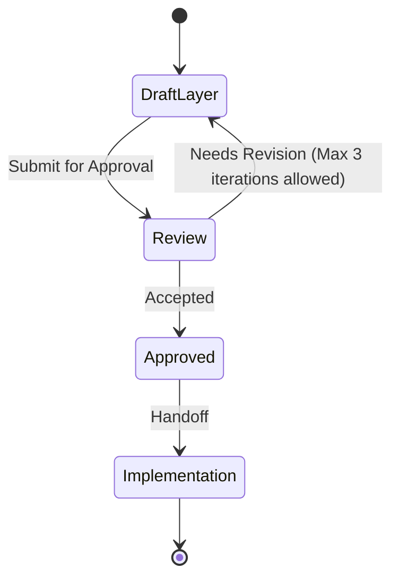

# {Layer Name} Layer

This file is a **Layer Consultant** payload. The MCP tool `get_layer_consultant` discovers it as `LAYER.md` under a layer directory. Skills treat MUST/NEVER as hard technical constraints. Keep rules executable by an agent reviewing a diff.

**Quality bar:** An agent can accept or reject a change in this layer using only this file plus the diff.

Place at the layer root, e.g. `src/ui/LAYER.md` or `src/infrastructure/db/LAYER.md`. One layer per file.

## Technical scope

- **Responsibility:** what this layer may do
- **Not responsible for:** business rules (those live in Domain consultants) and neighboring layers
- **Typical entry points:** packages, frameworks, or process types

## Allowed dependencies

| May depend on | How | Notes |
|---|---|---|
| Layer or library | import / HTTP / queue | version or adapter policy |

If a dependency is missing from this table, treat it as **disallowed** until a human updates the file.

## Forbidden dependencies

- NEVER import …
- NEVER reach across … (e.g. UI → database)

## MUST rules (technical)

- MUST keep I/O at the edges; no ad-hoc SQL/HTTP inside domain services unless this *is* the data layer
- MUST …
- MUST …

## NEVER rules (technical)

- NEVER log secrets, tokens, or raw personal data
- NEVER block the event loop / request thread on unbounded work
- NEVER …

## Patterns and frameworks

- Required stack (language, framework, migration tool) *as evidenced in the repo*
- Naming, folder layout, error-handling pattern
- Testing expectations for this layer (unit vs contract vs e2e)

## Observability and safety

- Required logs/metrics/traces (names, not vendor marketing)
- Timeouts, retries, idempotency keys — defaults for this layer
- How secrets are read (env/secret manager) — never hard-coded

## Change control

- What requires a Layer ADR (new framework, new datastore, dropped MUST)
- Compatibility: how this layer versions its interface to others

## Anti-patterns

- Business invariants copied from a domain (link the DOMAIN.md instead)
- "Use best practices" with no concrete rule
- Allowed-dependency lists that include everything in `package.json`
- Invented frameworks or certifications not present in the repo

## Skill State Machine (sdlc-layer-architect)

