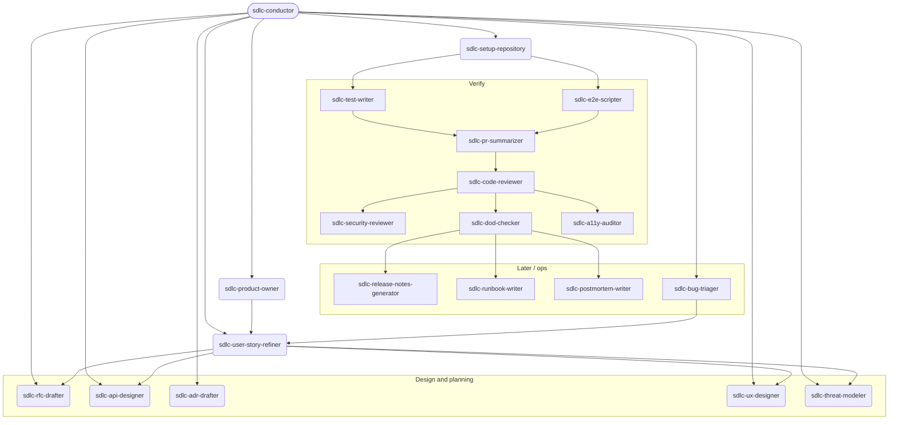

# Lifecycle Pipeline

Runtime pipeline graph for skill `sdlc-conductor`. Pair with `get_sdlc_template("lifecycle pipeline")` (aliases `conductor`, `sdlc conductor`). This payload is the **runtime SSOT** for legal states, skip policy, discovery signals, and the post-skill memory checklist. The human design note is `docs/technical_design/sdlc-conductor.md` when that file exists in the harness clone.

**Quality bar:** Recommend the next *legal* step for the **open workspace** (not hard-coded to `ai-sdlc-harness`). Do not invent UI, domain rules, or approvals. Do not collapse the graph to stories → setup → code.

## Human artefact approval

These artefacts do **not** count as approved / “ready for the next gate” just because a file was drafted or merged, or a backlog status flipped. Each requires a **named** human sign-off or an explicit “treat as approved” sentence. Do **not** invent stakeholder sign-off.

- Product specification
- Epics
- User stories (the **story artefacts** themselves — not only epics)
- Technical design documents, **including ADRs**

UI/UX stays in the design band: an **agreed** UX artefact or an explicit skip (same skip policy as every other stage). That agreement is still a human decision before implement; the named policy artefacts above are spec, epics, stories, and technical design/ADRs.

## Story implementation / Done

After the planning artefacts above are approved:

- A user story’s implementation is **Done** when **test automation passes without errors** AND **all Must acceptance criteria are fully met**.
- If some Must AC cannot be met: do **not** soft-pass — **create additional user stories** for the unmet criteria.

## Pipeline graph



```
vision
  → product-owner / product spec (draft)
    → product spec approval (human)
      → epic approval (human)
        → per-epic user-story refine (draft)
          → story approval (human)
            → design & planning band (per epic or per release slice — may parallelize where legal):
                 • technical design (architecture / API / RFC / ADR as needed)
                     → technical design / ADR approval (human)
                 • UI/UX design (`sdlc-ux-designer` — wireframes/flows/copy from stories; template `ux design`)
                 • test strategy (test_plan + e2e_test_plan; `sdlc-threat-modeler` when security-sensitive)
                 • domain/layer update when bounds actually change (hand off to architects)
              → setup-repository (when first code is about to land, if QA not already present)
                → implement against user-story + feature DoD (+ change-type DoD)
                  → verify (automation + `sdlc-pr-summarizer` / `sdlc-code-reviewer` / `sdlc-security-reviewer` / DoD / a11y) — Done only when tests pass with no errors AND all Must AC are met
                    → later/ops drivers as needed (`sdlc-bug-triager` is intake into triage → stories/fix, not the setup→tests happy path)
```

Design and planning are first-class. Do not dump RFC, API design, test strategy, or UX into “later drivers”.

| State | Default child / gate | Exit when |
|---|---|---|
| **Vision** | Human + existing vision (no new skill in v1) | User accepts a vision doc |
| **Product-owner / spec** | `sdlc-product-owner` | Spec + epic list are **drafted**; stories not written yet. Draft ≠ approval |
| **Product spec approval** | **Human** — do not invent sign-off | Named human sign-off or explicit “treat as approved”. A drafted or merged spec file is **not** enough. A backlog status flip is **not** enough |
| **Epic approval** | **Human** — do not invent sign-off | Named human sign-off or explicit “treat as approved”. Drafted/merged epic text and a status flip are **not** enough |
| **Story refine** | `sdlc-user-story-refiner` | Must AC are independently valuable and testable. Drafting the story artefacts is **not** approval |
| **Story approval** | **Human** — first-class gate on the **story artefacts**, not only epics | Named human sign-off or explicit “treat as approved” on the stories. Epic approval is not story approval. Drafted or merged story files are **not** enough |
| **Technical design** | `sdlc-rfc-drafter`, `sdlc-api-designer`, `sdlc-adr-drafter`; templates `rfc`, `api design` / `api contract`, `adr` | RFC and/or API design/contract **drafted**; ADR drafted if a decision is being recorded. Draft ≠ approval |
| **Technical design / ADR approval** | **Human** — do not invent sign-off | Named human sign-off or explicit “treat as approved” on the technical design documents **including ADRs**. Drafted or merged RFC/API/ADR files are **not** enough |
| **UI/UX design** | `sdlc-ux-designer` (`/ux`, `/ux-design`); template `ux design`. Never invent screens. Existing human/external artefacts still satisfy this state. `sdlc-a11y-auditor` is verify-time, not design-time | Agreed UX artefact exists, or explicit skip (e.g. no UI in this slice) |
| **Test strategy** | Templates `test_plan`, `e2e_test_plan`. `sdlc-threat-modeler` (template `threat_model`) when the slice is security-sensitive. `sdlc-security-reviewer` is **verify-time**. `sdlc-test-writer` / `sdlc-e2e-scripter` are **later execution**, not strategy authors | Test plan (and e2e plan when there is a journey) exists and is linked; threat model exists when warranted |
| **Domain / layer (in-band)** | `sdlc-domain-architect` / `sdlc-layer-architect` only when bounds **actually changed** | Relevant `DOMAIN.md` / `LAYER.md` exist and do not contradict spec/design — or no bound changed |
| **Setup-repo** | `sdlc-setup-repository` if first code is about to land and checks are missing. Brownfield: satisfied if CI/lint/secret-scan/ownership already exist — say so | Checks exist or user agrees the repo is already set up |
| **Implement** | Coding session against `user story` + `feature` DoD (and `ui change` / `api change` / `security change` when those apply) | Planning artefacts above are **approved** (or an explicit skip/treat-as-approved was recorded). Must AC in progress; no silent extra features |
| **Verify** | `sdlc-test-writer`, `sdlc-e2e-scripter` (execute the strategy), `sdlc-pr-summarizer` (PR packaging before or with review), `sdlc-code-reviewer`, `sdlc-security-reviewer` (control checklist on the change), `sdlc-dod-checker`, `sdlc-a11y-auditor` | **Done** only when test automation passes without errors **and** all Must AC are fully met. If some Must AC cannot be met: do **not** soft-pass — create additional user stories. Human review for consequential merges |
| **Later / ops** | `sdlc-bug-triager` (intake → diagnosable ticket → stories/fix), release notes, runbook, migration, postmortem, CI debugger | Current ship/ops or defect-intake need matches |

**Design-band scope (default):** require the band **per epic** for MVP epics that touch UX or new APIs. Allow an **explicit skip** for pure docs/chore epics. A shared release-slice band is legal when several thin epics share one API/UX surface — record which epics it covers. Technical design + ADRs in that band still need **human approval** before implement (named sign-off or “treat as approved”).

Optional on-ramp (not a skip of vision): `sdlc-researcher` when a spike is needed before an honest vision or spec.

## Skip policy

- **Default: do not skip.** Stories are not a license to code. Design/planning uses the **same** bar as every other stage.
- Skip only with an explicit user sentence (“skip setup-repo”, “skip UX — no UI”, “skip RFC, API frozen in `docs/…`”).
- Human approval gates (product spec, epics, stories, technical design/ADRs) advance only with a **named** human sign-off or an explicit “treat as approved” sentence. Merging a file or flipping a backlog status is **not** a skip and **not** approval.
- Record **what was skipped, why, and who agreed** in the backlog or next to the spec.
- Re-enter later if signals say the step is still missing.
- Experts who already named a child skill are not forced backward.

## Job A — inspect, recommend, confirm, hand off

Work the **target workspace**. Discover that repo’s docs/backlog conventions (same habit as `sdlc-docs-backlog-review`).

1. **Inspect** — vision, spec, backlog statuses, stories, design artefacts (RFC / API / test plan / UX), `DOMAIN.md` / `LAYER.md`, CI / `CODEOWNERS`, working tree. Cite files you actually opened. Look for **named** approval or a “treat as approved” sentence — not only that a file exists.
2. **Map** the strongest discovery signals (below) to one next legal state. If several band items are missing, you may recommend a **parallel** set (e.g. RFC + test plan) but still gate implement.
3. **Recommend** the next step and why (one short paragraph + cited paths). Name the child skill or human gate.
4. **Confirm** — wait for explicit user agreement before handing off or skipping.
5. **Hand off** — follow the child skill’s `CONTENT.md` / MCP contract in-session when available; otherwise tell the user to invoke that skill. After the outcome, run Job B.

### Discovery signals

Signals are implications, not proofs.

| Implied phase | Typical signals |
|---|---|
| **Vision needed** | No product vision; README is only a tech stub; raw idea only. |
| **Spec needed** | Vision exists; no product spec / epics / MVP split. |
| **Product spec approval needed** | Spec file exists; still draft / unapproved; no named human sign-off and no “treat as approved” sentence. |
| **Epic approval needed** | Spec approved (or treat-as-approved); epics still draft / unapproved. A backlog status flip alone is **not** approval. |
| **Story refine needed** | Approved epic with no BDD stories or missing Must AC. |
| **Story approval needed** | Story artefacts exist for the epic; still draft / unapproved. Drafted stories are not permission to design-skip or implement. |
| **Design / planning incomplete** | **Approved** stories exist for the slice about to be built, but RFC / API contract / UX artefact / test plan / e2e plan / threat model (when warranted) / stale `DOMAIN.md` is missing. **Not** ready to implement. |
| **Technical design needed** | Slice touches architecture or a new/changed API and there is no RFC, API design/contract, or ADR covering it. |
| **Technical design / ADR approval needed** | RFC / API design / ADR files exist; still draft / unapproved; no named human sign-off and no “treat as approved”. |
| **UI/UX needed** | Slice is user-facing and there is no agreed UX artefact. Hand off to `sdlc-ux-designer`. Do not invent screens. |
| **Test strategy needed** | Stories exist but no test plan (and no e2e plan when a journey exists). Security-sensitive slice with no threat model → `sdlc-threat-modeler`. |
| **Setup-repo needed** | Planning done or skipped; first code about to land; no CI / lint / SAST / secret-scan / `CODEOWNERS`. |
| **Implement** | **Approved** stories + AC; technical design/ADRs **approved** or explicitly skipped/treat-as-approved; remaining design/planning satisfied **or** explicitly skipped; repo checks exist **or** skipped. |
| **Verify needed** | Code exists but tests/review/DoD do not match the test strategy, automation is red, or Must AC are unmet. Thin or missing PR body → `sdlc-pr-summarizer`. Security-sensitive diff without a control checklist → `sdlc-security-reviewer`. |
| **Domain/layer steward** | Spec, RFC, or code names a context/layer and `DOMAIN.md` / `LAYER.md` is missing or contradicts design. Hand off to architect skills. |
| **Deep docs audit** | Many docs disagree with the tree. Invoke `sdlc-docs-backlog-review` — do not silently rewrite. |
| **Later / ops** | Incident, failing CI, ship, migration. Vague “it’s broken” / undiagnosed defect → `sdlc-bug-triager` (may then feed stories or a scoped fix). Design-time RFC/ADR/threat work belongs in the planning band. |

Honesty: a labeled “planned” section is not missing implementation. Green CI is not approval and not permission to merge. Drafted or merged files (spec, epics, stories, RFC/ADR) are not approval. A backlog status flip is not named human approval. Refined stories are not story approval and not permission to skip design. Do not invent stakeholder sign-off.

## Job B — post-skill memory checklist

After a confirmed child outcome, make a **small** evidence-only sync. Prefer frequent tiny updates over a rewrite.

| Artefact | Update when | Do **not** |
|---|---|---|
| Backlog | Status/evidence drifted; leftover work appeared; a skip was agreed | Invent epics; mark Done without evidence / invent approval |
| Vision ↔ spec links | Headings or MVP split changed | Rewrite product claims |
| User-story index | New stories or paths | Author the stories; treat new drafts as approved |
| Design-artefact index | RFC, API design/contract, test plan, e2e plan, UX artefact, or threat model landed | Author those bodies; treat drafts as approved |
| ADRs | A decision was **accepted** (named human sign-off or “treat as approved”) | Draft every chat as an ADR — use `sdlc-adr-drafter`; mark Accepted without approval |
| `DOMAIN.md` / `LAYER.md` | Bound already designed or shipped | Invent MUST/NEVER |
| README / install pointers | A shipped driver or path changed **in this repo** | Giant catalog rewrites |

If the checklist would become a full-repo audit, **stop** and recommend `/docs-backlog-review`.

## Relationship to child skills

- **`sdlc-product-owner`** — vision → epics / spec **drafts**. Next gates are human spec approval and human epic approval. Does not approve stories.
- **`sdlc-user-story-refiner`** — per-epic BDD stories after epic approval. Drafting ≠ approval; next gate is human **story** approval.
- **`sdlc-rfc-drafter` / `sdlc-api-designer` / `sdlc-adr-drafter`** — technical design band (draft). Next gate is human technical design / ADR approval. You sync links; they author bodies.
- **`sdlc-ux-designer`** — UI/UX design band. Authors wireframes/flows/copy from stories via template `ux design`. You sync links; they author the artefact. A human/external artefact still satisfies the state. `sdlc-a11y-auditor` stays verify-time.
- **Test strategy vs execution** — `test_plan` / `e2e_test_plan` and `sdlc-threat-modeler` (when the slice is security-sensitive) **before** code. `sdlc-test-writer` / `sdlc-e2e-scripter` execute at verify time. `sdlc-security-reviewer` is the verify-time control checklist, not the strategy author.
- **`sdlc-setup-repository`** — after planning, before first implement, unless brownfield CI already satisfies.
- **`sdlc-domain-architect` / `sdlc-layer-architect`** — when bounds actually change.
- **`sdlc-docs-backlog-review`** — deep audit + review PR left open (template `docs backlog review`). Invoke when drift is systemic. Not a silent daily rewrite.
- **`sdlc-docs-updater`** — docs for a recent code change only.
- **`sdlc-researcher`** — optional spike; does not replace vision, spec, or the design band.
- **Verify-adjacent** — test-writer, e2e-scripter, `sdlc-pr-summarizer` (package the PR before or with review), `sdlc-code-reviewer`, `sdlc-security-reviewer`, dod-checker, a11y-auditor.
- **Later / ops** — `sdlc-bug-triager` (intake → triage → stories/fix; not the setup→tests happy path), release notes, runbook, migration, postmortem, CI debugger.

## Landing changes

1. Prefer the user’s existing branch. If you must open a docs-only PR, leave it **open** — do not merge.
2. Consequential product/code merges stay **human-gated**. Green CI is not permission to merge.

If nothing material changed, do not open an empty PR. Report the recommendation and stop.

## Anti-patterns

- Stories → setup → code as the main path
- Invented UI, DOMAIN/LAYER MUST/NEVER, or any artefact approval (spec, epic, story, technical design/ADR)
- Treating a draft, merge, or backlog status flip as approval
- Marking a story Done when automation failed or Must AC are unmet (do not soft-pass — split unmet Must AC into new stories)
- Skipping design/planning without an explicit user sentence and a recorded skip
- Treating `sdlc-test-writer` as the test-strategy author or `sdlc-a11y-auditor` as a UX designer
- Merging PRs, force-pushing the default branch, or deleting review branches
