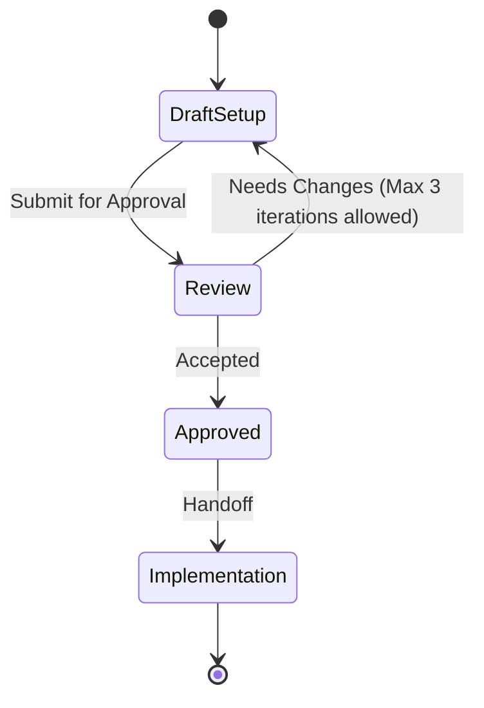

# Repository Setup Template

Structured configuration output for initializing a repository's QA checks and foundational metadata. Pair with skill `sdlc-setup-repository` and Definition of Done `repository_setup`.

**Quality bar:** The setup covers basic testing, linting, security, and ownership according to the repository's tech stack. Configurations use pinned or stable action versions.

## Metadata

| Field | Value |
|---|---|
| Target Repository | <repo_name or description> |
| Primary Tech Stack | <e.g., Python, Bash, Markdown> |
| CI/CD System | <e.g., GitHub Actions, GitLab CI> |

## Purpose Summary

2–3 sentences defining what this repository is built for and what type of content is expected to be maintained within it.

## Stack mapping

Propose only checks that match the repo's expected content. Use this mapping (similar to the `.github` workflows in `ai-sdlc-harness`) rather than inventing a different QA menu:

| Content | Propose |
|---|---|
| Bash scripts | `bats` for testing and `shellcheck` for linting |
| Python | SAST such as `bandit` (and the repo's existing test runner if one exists) |
| Markdown documentation | `markdownlint` |
| Any repo | Universal secret scanning (`gitleaks`) and a `CODEOWNERS` file |

Do not propose language-specific checks for languages the user did not name.

## Configurations

For each proposed check, provide the configuration snippet (e.g., the `.yaml` workflow file content) and a brief justification for why it was selected.

### Security

- Secret Scanning (e.g., `gitleaks`)
- SAST (e.g., `bandit` for Python, if applicable)

### Linting & Formatting

- Code linting (e.g., `shellcheck`, `eslint`, `ruff`)
- Documentation linting (e.g., `markdownlint`)

### Testing

- Unit testing framework integrations (e.g., `bats`, `pytest`)

### Ownership

- `CODEOWNERS` template

## Checklist

- [ ] Purpose and content types have been identified.
- [ ] Universal secret scanning is configured.
- [ ] Language-specific linting is configured.
- [ ] Default code ownership is established.
- [ ] CI/CD actions/versions are secure and standard.

## Anti-patterns

- Proposing language-specific checks for languages not used in the repo.
- Missing universal secret scanning.
- Over-complicating the initial setup with heavy E2E tests when no code exists yet.

## Skill State Machine (sdlc-setup-repository)

