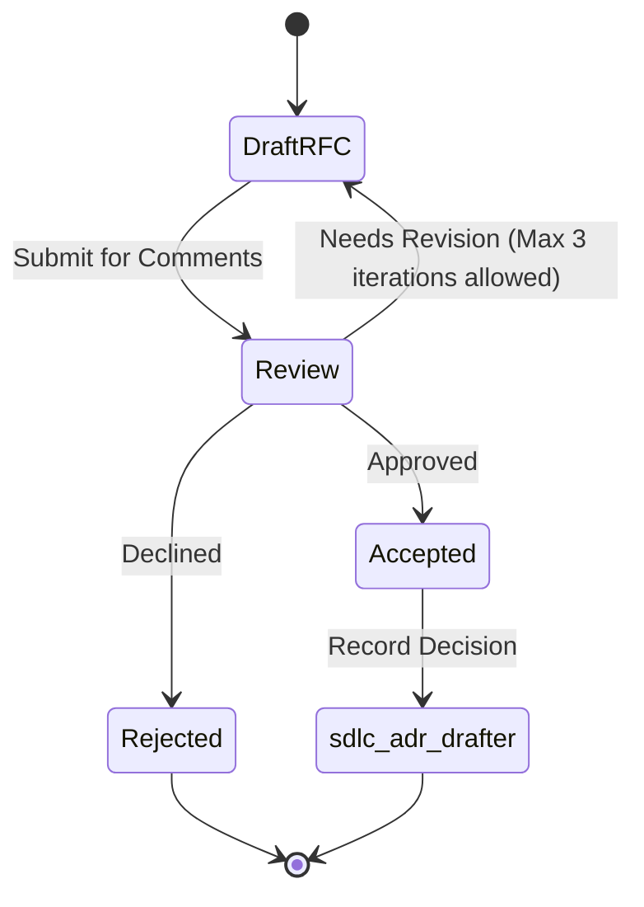

# Request for Comments (RFC)

Use this when a change is still being **decided**. Pair with skill `sdlc-rfc-drafter`. When the choice is locked, write or update an ADR; do not leave an Accepted ADR's content only inside an RFC.

**Quality bar:** Reviewers can argue about a concrete proposal, not a vibe. Open questions are explicit. Alternatives are real. No fake consensus or invented stakeholder sign-off.

## Title

`RFC-NNNN: <decision this document will enable>`

## Metadata

| Field | Value |
|---|---|
| Status | Draft / In review / Accepted / Rejected / Withdrawn / Superseded |
| Authors | roles |
| Reviewers wanted | roles / layers / domains |
| Last updated | date |
| Related | tickets, ADRs, prior RFCs |

## Objective

What becomes true if this RFC is accepted, and why now. Include the cost of doing nothing.

## Scope

- **In scope**
- **Out of scope** (and which doc will cover it)
- **Non-goals**

## Current state

How the system works today (evidence: paths, APIs, DOMAIN/LAYER constraints). Mark guesses as `hypothesis`.

## Proposed solution

Enough detail that an implementer could start an ADR or a spike:

- Architecture / data flow (words or a simple mermaid sketch)
- API or entity changes (link `api_design` / `api_contract` if those apply)
- Migration and rollback posture (link `migration_plan` / `rollout_plan` if needed)
- Security, privacy, and abuse surfaces at a **defensive** level (no exploit steps)
- Observability: what we will measure to know it worked

## Alternatives considered

| Alternative | Pros | Cons | Why not (or not yet) |
|---|---|---|---|
| Do nothing | … | … | … |
| … | … | … | … |

## Impact

- **Users** — behavior they will notice
- **Engineering** — teams, layers, operability
- **Compatibility** — breaking changes, flags, deprecation window

## Open questions

Numbered. Each question names who can answer it (role) and what is blocked until then.

1. …

## Success criteria

How we will know the proposal worked after implementation (signals, tests, SLOs already in the repo — do not invent targets).

## Rollout sketch

High-level only: flag, stages, rollback. Details belong in `rollout_plan` once accepted.

## Decision

Leave blank until review concludes. Then: accept / accept with changes / reject, plus the ADR id if one is cut.

## Anti-patterns

- Solution-only docs with no problem or alternatives
- "We will use Kubernetes" without saying what problem that solves
- Hidden breaking changes
- Security or compliance certifications as rhetoric
- Writing as if the RFC is already approved

## Skill State Machine (sdlc-rfc-drafter)

