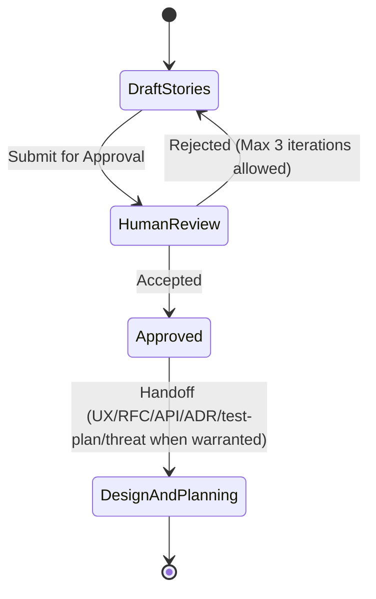

# User Story Template

Use this to turn a request into an independently valuable, testable slice. Pair with skill `sdlc-user-story-refiner` and Definition of Done `user story` / `story`.

**Quality bar:** A developer can implement without inventing actors or metrics. A tester can fail the story from the acceptance criteria alone. Scope fits in one PR-sized increment unless the story says otherwise.

## Title

Action-oriented, user language: `Payer downloads last month's invoice as PDF`.

## User story

**As a** [role that exists in the product or the user's brief]
**I want to** [action]
**So that** [value — the reason we would ship this]

Split if there are multiple actors or independent values. Do not add personas or KPIs the user did not provide.

## Background

- Problem today (one paragraph)
- Domain constraints fetched via `get_domain_consultant` (names + MUST/NEVER that apply)
- Out of scope for this story

## Acceptance criteria

Testable Given / When / Then. Include at least one unhappy or empty path when the happy path implies it.

- **Scenario: happy path**
  - Given [stated context]
  - When [action]
  - Then [observable outcome]
- **Scenario: authorization / validation failure**
  - Given …
  - When …
  - Then …
- **Scenario: empty or idempotent case** (if relevant)
  - Given …
  - When …
  - Then …

Mark each criterion `Must` or `Nice` — Nice items do not block the story DoD.

## Analytics and observability (optional)

Only if the user asked or the domain requires it. Event names must already exist or be proposed as new (do not invent business metrics).

## Design and a11y notes

- UI copy or states *given by the user or existing UI*
- Keyboard / name / error exposure if this story is user-facing (see `accessibility_audit`)

## Dependencies and risks

- Blocked by / blocks
- Feature flag
- Data or API contract that must land first
- Open questions (do not fill with fiction)

## Implementation notes

Optional, short: likely layer, existing modules, "do not touch X". Not a design spec.

## Anti-patterns

- Stories that are tasks ("Add index") with no user value
- AC that restates the story without an observable Then
- Hidden scope ("and also rewrite settings")
- Invented SLAs, conversion lifts, or personas

## Skill State Machine (sdlc-user-story-refiner)

