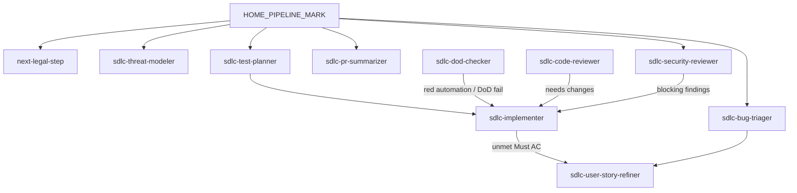

# Fixture lifecycle pipeline

## Pipeline graph

```mermaid
flowchart TD
    HOME_PIPELINE_NODE[HOME_PIPELINE_MARK]
    HOME_PIPELINE_NODE --> NEXT[next-legal-step]
    Threat[sdlc-threat-modeler]
    Sec[sdlc-security-reviewer]
    Triage[sdlc-bug-triager]
    PRSum[sdlc-pr-summarizer]
    Planner[sdlc-test-planner]
    Implementer[sdlc-implementer]
    Refiner[sdlc-user-story-refiner]
    DoD[sdlc-dod-checker]
    CodeReviewer[sdlc-code-reviewer]
    HOME_PIPELINE_NODE --> Threat
    HOME_PIPELINE_NODE --> Sec
    HOME_PIPELINE_NODE --> Triage
    HOME_PIPELINE_NODE --> PRSum
    HOME_PIPELINE_NODE --> Planner
    Planner --> Implementer
    DoD -->|"red automation / DoD fail"| Implementer
    CodeReviewer -->|"needs changes"| Implementer
    Sec -->|"blocking findings"| Implementer
    Implementer -->|"unmet Must AC"| Refiner
    Triage --> Refiner
```

Other template prose should not become a second diagram source of truth.

At most 3 re-entry loops for the same slice, then escalate to the human.
