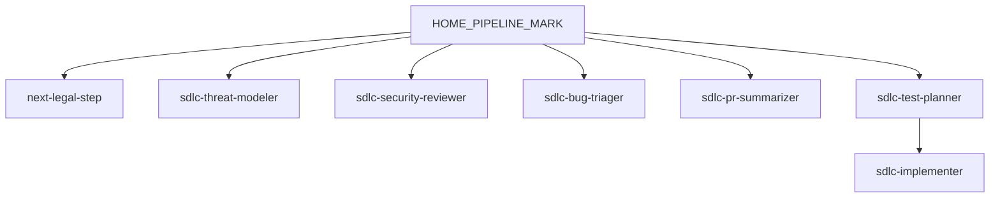

# Fixture lifecycle pipeline

## Pipeline graph

```mermaid
flowchart TD
    HOME_PIPELINE_NODE[HOME_PIPELINE_MARK]
    HOME_PIPELINE_NODE --> NEXT[next-legal-step]
    Threat[sdlc-threat-modeler]
    Sec[sdlc-security-reviewer]
    Triage[sdlc-bug-triager]
    PRSum[sdlc-pr-summarizer]
    Planner[sdlc-test-planner]
    Implementer[sdlc-implementer]
    HOME_PIPELINE_NODE --> Threat
    HOME_PIPELINE_NODE --> Sec
    HOME_PIPELINE_NODE --> Triage
    HOME_PIPELINE_NODE --> PRSum
    HOME_PIPELINE_NODE --> Planner
    Planner --> Implementer
```

Other template prose should not become a second diagram source of truth.
